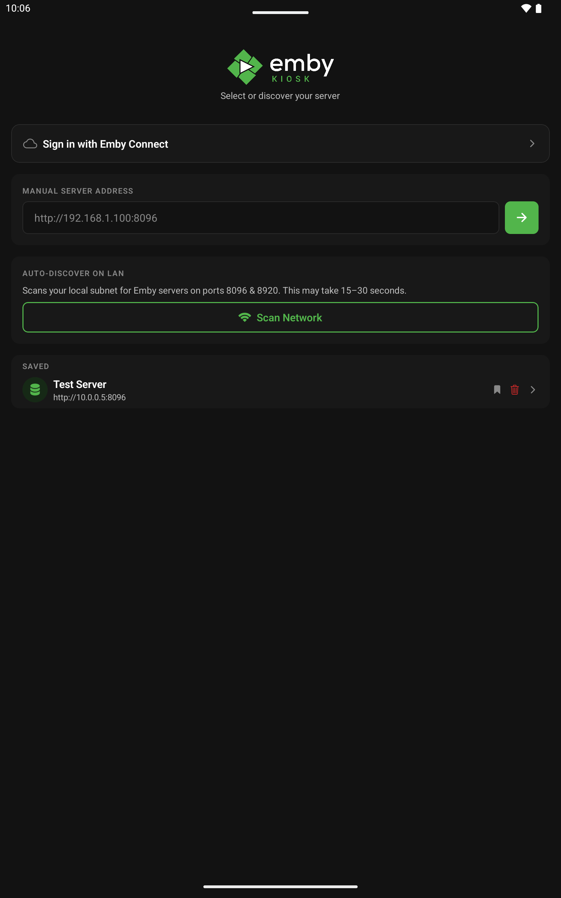
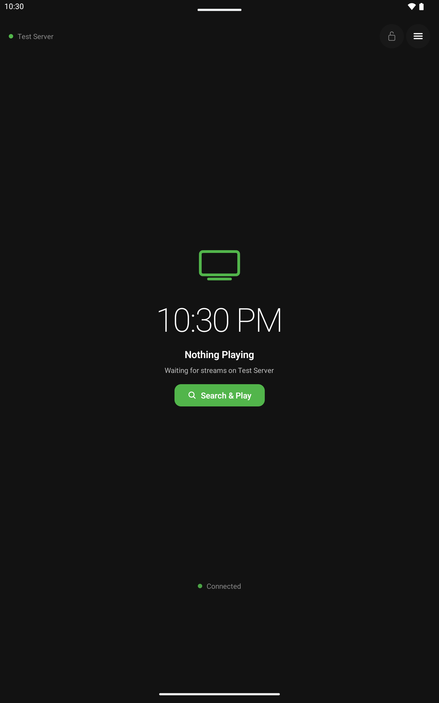
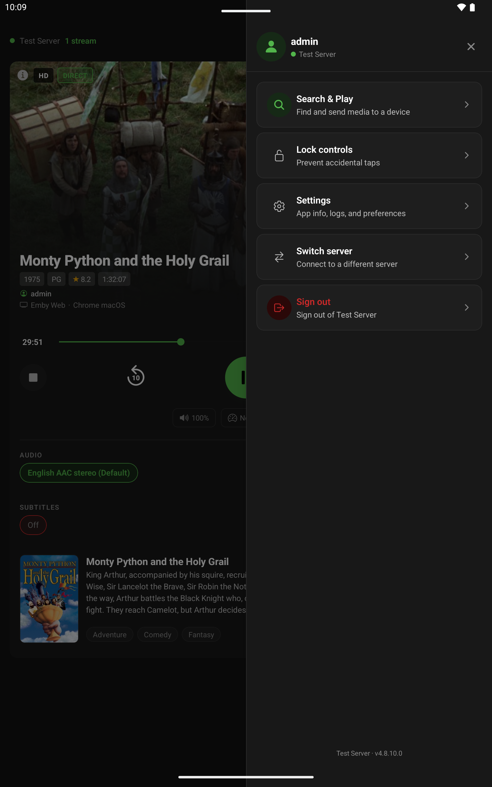
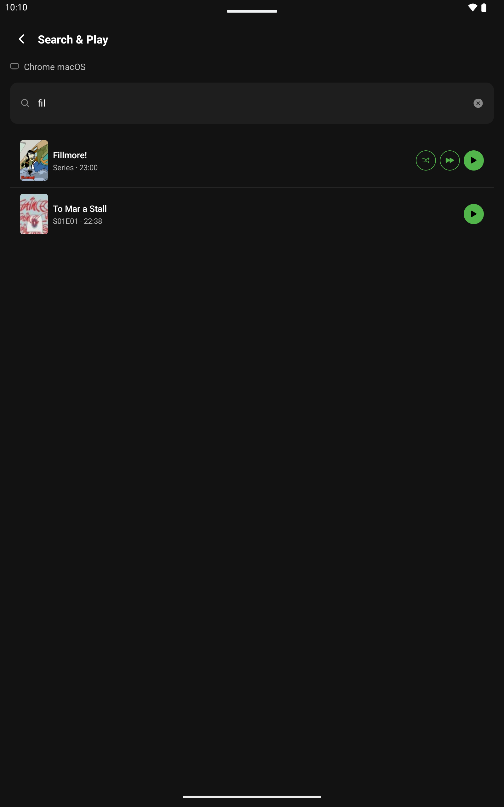
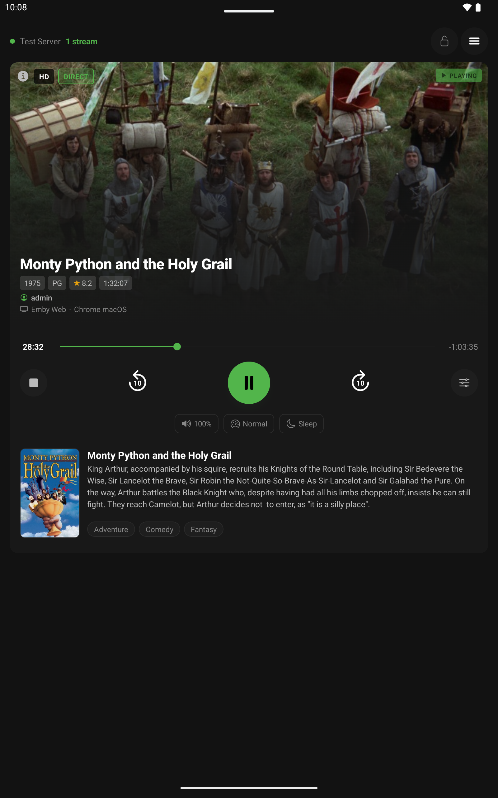
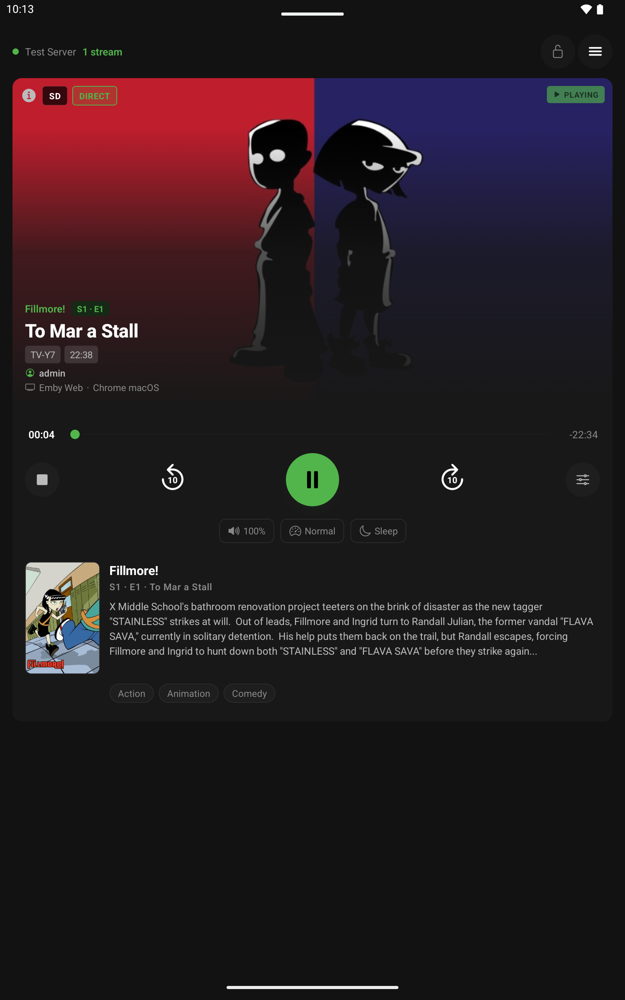
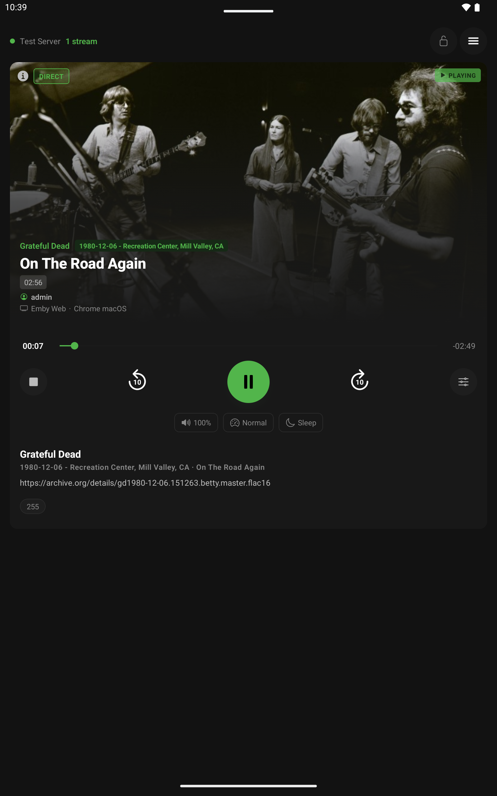
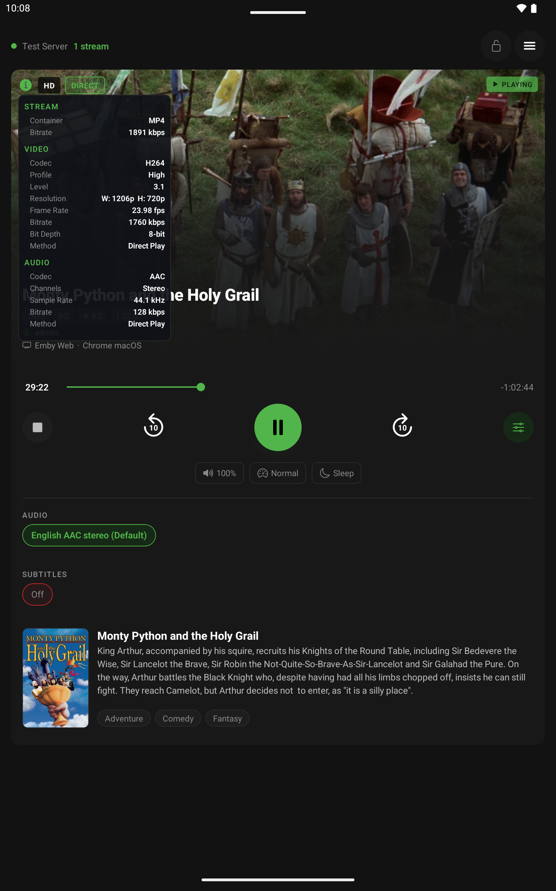

<div align="center">


# Emby Kiosk

**A dedicated remote control and monitoring app for your Emby media server.**
Know what's playing, control it from anywhere in the house, and send new content to any screen — all from a single, always-on panel.

[](https://github.com/Kenttleton/emby-kiosk/releases/latest)
[](LICENSE)
[](https://github.com/Kenttleton/emby-kiosk/releases)

[**Download Latest Release**](https://github.com/Kenttleton/emby-kiosk/releases/latest) · [Report a Bug](https://github.com/Kenttleton/emby-kiosk/issues) · [Request a Feature](https://github.com/Kenttleton/emby-kiosk/issues)

</div>

---

> **⚠️ Unsigned releases**
> Builds distributed through GitHub are signed with a debug key for sideloading only. They have not been reviewed or signed by Google or Apple. Install at your own risk. To get a verified build, clone the repository and build it yourself.discovery


---

## What is Emby Kiosk?

Emby Kiosk turns any phone, tablet, or touchscreen panel into a dedicated control surface for your Emby server. Mount it on a wall, set it on a shelf, or hand it to someone who just wants to pause a movie without touching the TV — it stays in sync with what's playing and puts the controls right there.

It's built for households with multiple screens and multiple viewers. Admins can see and control every active stream on the server at once. Regular users see only their own sessions. Nobody accidentally pauses someone else's movie.

---

## Screenshots

<!-- Drop screenshots into assets/screenshots/ and they will appear here -->

| Discovery | Nothing Playing | Drawer | Search &  Play |
|:-:|:-:|:-:|:-:|
|  | |  |   |

| Now Playing - Movies | Now Playing - TV Show | Now Playing - Music | Stream Info | 
|:-:|:-:|:-:|:-:|
|  |  |  |  |  | |

---

## Features

### Now Playing
Real-time session cards pulled live over WebSocket — no polling lag. Each card shows the backdrop, poster, title, episode info, rating, year, and a scrubber that tracks the actual playback position.

### Full Remote Control
Play, pause, stop, seek, adjust volume, change playback speed, and set a sleep timer without ever touching the device that's playing. Switch audio tracks and subtitle tracks on the fly.

### Multi-Session Support
All active sessions on your server shown in a swipeable card stack. Admins see every stream at once; regular users see only their own. Duplicate client names are disambiguated automatically.

### Search & Play
Search your entire library — movies, shows, and individual episodes — and send content directly to any connected device. Resume where you left off, play from the start, or shuffle a full series. Server admins have full access; regular users still maintain server restrictions on content.

### Stream Info Panel
Tap the **ⓘ** badge on any session card to see a live breakdown of what the server is actually doing: container format, overall bitrate, video codec, profile, level, resolution, frame rate, bit depth, audio codec, channel layout, sample rate, and whether each track is direct-playing or transcoding. Dropped frame counts appear when transcoding is struggling.

### Controls Lock
A parental-control-style lock that prevents accidental taps. Unlocking requires your Emby password — verified against Emby Connect for Connect users, or the local server for local accounts. Great for households with small humans.

### Self-Updating
The app checks GitHub Releases on launch and shows an update banner in the drawer when a newer version is available. On Android, tap the banner to download and install in place. On iOS, tap to open the release page.

### Server Discovery
Automatically scans your LAN for Emby servers or connect manually by IP, hostname, or domain. Proxied setups with no explicit port are handled correctly using standard HTTP/HTTPS defaults. Emby Connect linked servers are also supported.

---

## Getting the App

### Download a release

1. Go to the **[Releases](https://github.com/Kenttleton/emby-kiosk/releases)** page
2. Download the latest asset for your platform:
   - **Android** → `emby-kiosk-vX.Y.Z.apk`
   - **iOS** → `emby-kiosk-vX.Y.Z-unsigned.ipa`

**Install on Android:**

1. Transfer the `.apk` to your device (USB, cloud storage, or direct download)
2. Settings → Security → Install unknown apps → allow your file manager or browser
3. Tap the file to install

Or with ADB (USB debugging must be enabled):
```bash
adb install emby-kiosk-vX.Y.Z.apk
```

**Install on iOS (unsigned — requires one of the following):**

- **[AltStore](https://altstore.io)** — sign with your Apple ID, no jailbreak needed (re-sign every 7 days on a free account)
- **[Sideloadly](https://sideloadly.io)** — similar to AltStore, works over USB
- **Filza** on a jailbroken device — install the `.ipa` directly

---

## Building from Source

### Prerequisites

- **Node.js 24 LTS** — [nodejs.org](https://nodejs.org)
- **[just](https://github.com/casey/just)** — optional task runner that wraps the common commands
  - macOS / Linux: `brew install just` or `cargo install just`
  - Windows: `winget install Casey.Just` or `scoop install just`

```bash
git clone https://github.com/Kenttleton/emby-kiosk.git
cd emby-kiosk
npm install
```

### Android

Requires **[Android Studio](https://developer.android.com/studio)**, which bundles the Android SDK and OpenJDK 17.

Set `ANDROID_HOME` if Gradle can't find the SDK:

**macOS / Linux (add to `~/.zshrc`, `~/.bashrc`, or equivalent):**
```bash
# macOS
export ANDROID_HOME=$HOME/Library/Android/sdk
# Linux
export ANDROID_HOME=$HOME/Android/Sdk

export PATH=$PATH:$ANDROID_HOME/platform-tools
```

**Windows (PowerShell — add to your profile or set via System Properties → Environment Variables):**

```powershell
$env:ANDROID_HOME = "$env:LOCALAPPDATA\Android\Sdk"
$env:PATH = "$env:PATH;$env:ANDROID_HOME\platform-tools"
```

Or as persistent user environment variables via `setx`:

```cmd
setx ANDROID_HOME "%LOCALAPPDATA%\Android\Sdk"
setx PATH "%PATH%;%LOCALAPPDATA%\Android\Sdk\platform-tools"
```

**Development (live reload on a connected device):**

```bash
# macOS / Linux
just dev

# Windows (without just)
npx expo prebuild --platform android --non-interactive
cd android && gradlew.bat installDebug && cd ..
```

**Release APK:**

```bash
# macOS / Linux
just release
# → android/app/build/outputs/apk/release/app-release.apk

# Windows (without just)
npx expo prebuild --platform android --non-interactive
cd android && gradlew.bat assembleRelease && cd ..
# → android\app\build\outputs\apk\release\app-release.apk
```

**After changing `app.json`, icons, or adding a native module:**

```bash
# macOS / Linux
just prebuild-dev   # regenerates native resources then builds

# Windows (without just)
npx expo prebuild --platform android --non-interactive
cd android && gradlew.bat installDebug && cd ..
```

**Common `just` recipes (macOS / Linux):**

| Command | What it does |
|---|---|
| `just dev` | Build and install on a connected device |
| `just metro` | Start Metro bundler only |
| `just release` | Prebuild + assemble release APK |
| `just clean` | Wipe Gradle build cache |
| `just reset` | Full reset: node_modules + Gradle + Metro cache |
| `just tag 1.0.0` | Bump version, commit, and create a release tag |

> **Windows note:** `just` works on Windows but Gradle commands in the `justfile` use `./gradlew`. Either install `just` and use Git Bash / WSL, or run the equivalent `gradlew.bat` commands shown above in PowerShell or Command Prompt.

### iOS

Requires **Xcode** (macOS only) and **CocoaPods**. iOS builds are not supported on Linux or Windows.

```bash
npx expo prebuild --platform ios --non-interactive
cd ios && pod install && cd ..
open ios/EmbyKiosk.xcworkspace
```

Build and run from Xcode targeting a simulator or connected device. For a signed IPA, see the commented-out signing steps in [.github/workflows/release.yml](.github/workflows/release.yml).

---

## Releasing a New Version

```bash
just tag 0.2.0
git push && git push origin v0.2.0
```

GitHub Actions builds the APK and unsigned IPA automatically and attaches them to a GitHub Release.

---

## CI/CD

| Job | Runner | Output |
|---|---|---|
| `android` | ubuntu-latest | Debug-signed APK (sideloadable) |
| `ios` | macos-latest | Unsigned IPA (AltStore / Sideloadly) |
| `release` | ubuntu-latest | GitHub Release with both artifacts |

iOS does not gate the release — the APK publishes even if the iOS build fails. Store signing (Google Play / App Store) is stubbed out in the workflow as commented blocks, ready to enable when credentials are available.

---

## Project Structure

```
emby-kiosk/
├── app/                          # Expo Router screens
│   ├── _layout.tsx               # Root layout, update check on launch
│   ├── index.tsx                 # Server discovery / selection
│   ├── login.tsx                 # User login
│   ├── connect-login.tsx         # Emby Connect login
│   ├── kiosk.tsx                 # Main kiosk screen
│   ├── search.tsx                # Search & Play
│   └── settings.tsx              # Settings
├── src/
│   ├── components/               # UI components
│   ├── hooks/                    # WebSocket, stable session list
│   ├── services/                 # Emby API, discovery, update check, logger
│   ├── store/                    # Zustand state
│   ├── types/emby.ts             # TypeScript types for all Emby objects
│   ├── theme.ts                  # Colors, spacing, typography
│   └── utils.ts                  # Helpers
├── scripts/bump-version.js       # Semver bump utility
├── .github/workflows/release.yml # Tag-triggered CI/CD
├── justfile                      # Developer workflow recipes
└── app.json                      # Expo config
```

---

## Troubleshooting

| Problem | Fix |
|---|---|
| LAN scan finds nothing | Confirm Emby is on port 8096 or 8920; check your firewall |
| Login fails | Emby usernames are case-sensitive |
| Images don't load | Confirm the device can reach the server IP on the same subnet |
| Remote control does nothing | The target session must support remote control — check the stream info panel |
| Icon not updating after asset change | Run `just prebuild` — Gradle does not regenerate icons, only `expo prebuild` does |
| `prebuild` fails | Delete `android/` and re-run `npx expo prebuild --platform android` |
| Gradle build fails | Confirm `ANDROID_HOME` is set; run `just clean` then retry |
| USB device not detected | Run `just clean-usb` to restart the ADB server |

---

## Contributing

Pull requests are welcome. For significant changes, open an issue first to discuss the approach.

```bash
npm install
just dev   # live reload on a connected device
```

---

## License

[Mozilla Public License Version 2.0](LICENSE)

---

<div align="center">
Built for people who just want to pause the movie without getting off the couch.
</div>
